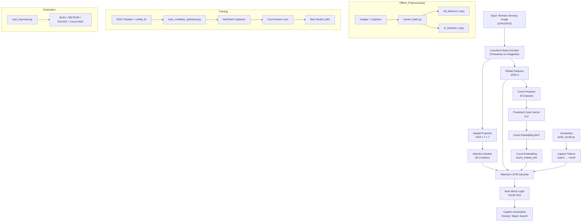

# Project Flow & File Guide (RSIC-Count++)

This document explains the **end-to-end processing flow** of the project and the **importance of each major file/folder**.

---

## 0) Workflow Diagram (Model + Data Pipeline)

---

## 1) High-Level Processing Flow

### Step A — Prepare data (inputs)
- **Input images** live under:
  - `data/images/` (69 unique aerial/satellite images)
- **Augmented captions** and **counts** are stored as JSON:
  - `data/captions_augmented.json` (1242 samples)
  - `data/counts_augmented.json`

**Why it matters:** captions drive the language model training; counts provide quantitative supervision.

---

### Step B — Build vocabulary
- Run `preprocess/build_vocab.py` to build a vocabulary from augmented captions.
- Output:
  - `data/vocab_augmented.pkl`

**Why it matters:** converts words into integer token IDs for training/inference.

---

### Step C — Extract visual features (offline)
- Run `preprocess/extract_feats.py` to extract ConvNeXt-Base features for every image.
- Outputs:
  - `data/att_features_aug/*.npy` (spatial features, 1024×7×7, used by attention)
  - `data/fc_features_aug/*.npy` (global features, 1024-d)

**Why it matters:** training becomes faster and lighter because the CNN is not run during every epoch.

---

### Step D — Load training data
- `dataset/rsic_dataset.py` loads:
  - feature `.npy` files
  - caption strings
  - count dictionaries
- Produces batches via `collate_fn()` containing:
  - `att`, `fc`, `captions`, `count_vecs`

**Why it matters:** data loading controls training throughput and correct alignment between features/captions/counts.

---

### Step E — Train (multi-task)
- Run:
  - `train_multitask_optimized.py`
- What happens:
  - Model predicts **next-word tokens** (captioning)
  - Model predicts **count vector** (counting head)
  - Joint loss updates shared parameters
- Outputs:
  - `checkpoints/best.pth`
  - `checkpoints/last.pth`

**Why it matters:** this is the main training pipeline optimized for limited VRAM GPUs (AMP + gradient clipping).

---

### Step F — Evaluate
- Run:
  - `eval_improved.py`
- What happens:
  - Generates captions (batch decoding)
  - Applies anti-repetition logic (to improve readability/metrics)
  - Computes BLEU/METEOR and Count-MAE
- Output:
  - `evaluation_improved.json` (by default)

**Why it matters:** measures caption quality + quantitative accuracy and helps compare experiments.

---

### Step G — Demo / Inference
- Run:
  - `demo.py`
- What happens:
  - Loads model checkpoint + vocab
  - Extracts features for a single image (online extraction)
  - Generates caption (greedy or beam search)
  - Optionally visualizes attention

**Why it matters:** quick qualitative testing on a single image.

---

### Step H — Attention visualization
- Use:
  - `models/visualization.py`
- Produces:
  - per-word attention overlays
  - average attention heatmaps
  - optional GIF/video showing attention over time

**Why it matters:** interpretability: you can see where the model “looked” for each generated word.

---

## 2) Folder-by-Folder Overview

### `data/`
- **Purpose:** stores dataset artifacts and extracted features.
- Key items:
  - `captions_augmented.json`: augmented image-to-caption mapping (1242 samples)
  - `counts_augmented.json`: image-to-count mapping (8 categories)
  - `images/`: raw images (69 unique aerial/satellite images)
  - `att_features_aug/`: spatial features (`.npy`, ConvNeXt-Base, 1024-d)
  - `fc_features_aug/`: global features (`.npy`, ConvNeXt-Base, 1024-d)
  - `vocab_augmented.pkl`: vocabulary built from augmented captions

---

### `preprocess/`
- **Purpose:** one-time/offline preprocessing scripts.
- Files:
  - `build_vocab.py`
    - Builds vocabulary (`stoi`, `itos`) and saves `vocab.pkl`.
  - `extract_feats.py`
    - Loads pretrained ConvNeXt-Base and extracts:
      - attention features (7×7 grid, 1024-d)
      - FC features (1024-d)

---

### `dataset/`
- **Purpose:** PyTorch dataset + collation.
- Files:
  - `rsic_dataset.py`
    - `RSICDataset`: reads captions/counts + loads feature files.
    - `_count_dict_to_vector()`: maps count dict → fixed 8D vector.
    - `collate_fn()`: pads captions and stacks tensors.

---

### `models/`
- **Purpose:** model architectures.
- Files:
  - `att_lstm_count.py`
    - Baseline LSTM captioner with soft attention + count embedding.
    - `SoftAttention`: attends over 49 spatial locations.
    - `generate()`: greedy decoding (includes anti-repetition controls).
  - `multitask_count_caption.py`
    - `MultiTaskCaptioner`: predicts counts + generates captions.
    - `CountAwareLoss`: weighted caption + count loss.
    - `generate_with_predicted_counts()`: uses predicted counts at inference.
  - `transformer_count.py`
    - Transformer decoder captioner using memory = [spatial + fc + count].
    - `beam_search_generate()`: transformer beam search.
  - `visualization.py`
    - Attention heatmap visualization utilities.

---

### `utils/`
- **Purpose:** decoding + evaluation utilities.
- Files:
  - `beam_search.py`
    - `beam_search()`: LSTM beam search (includes anti-repetition controls).
    - `beam_search_batch()`: loops over items for beam decoding.
  - `metrics.py`
    - BLEU/METEOR/ROUGE/CIDEr (if available)
    - Count metrics (MAE/MSE/RMSE/accuracy)

---

## 3) Top-Level Scripts (When to use what)

### `train_multitask_optimized.py`
- **Use for:** training the multi-task model.
- **Key outputs:** `checkpoints/best.pth`, `last.pth`.

### `eval_improved.py`
- **Use for:** evaluation with anti-repetition decoding and metric reporting.

### `demo.py`
- **Use for:** quick single-image inference and optional attention visualization.

### `create_augmented_dataset.py`
- **Use for:** creating augmented dataset with flips and rotations.

---

## 4) Configuration and Experiment Tracking

### `config.yaml`
- **Purpose:** central place to store data/model/training settings.
- **Note:** current training/eval scripts use CLI args; you can upgrade them to read from `config.yaml` for reproducibility.

---

## 5) Recommended “Standard Run” (Typical Order)

1) Build vocab
- `python preprocess/build_vocab.py --captions data/captions_augmented.json --output data/vocab_augmented.pkl --freq_threshold 5`

2) Extract features
- `python preprocess/extract_feats.py --images_dir data/images --captions data/captions_augmented.json --att_output data/att_features_aug --fc_output data/fc_features_aug --backbone convnext_base --device cuda`

3) Train
- `python train_multitask_optimized.py --config config.yaml --device cuda`

4) Evaluate
- `python eval_improved.py --checkpoint checkpoints/best.pth --config config.yaml --device cuda`

5) Demo
- `python demo.py --checkpoint checkpoints/best.pth --image data/images/<your_image>.png --config config.yaml --device cuda`

---

## 6) Upgrades (Next Work)

- Additional data augmentation strategies.
- Better decoding controls (top-k/top-p, stronger repetition constraints).
- Faster dataset loading (feature caching/memmap) for quicker training.
- Single CLI pipeline using `config.yaml` for fully reproducible experiments.
